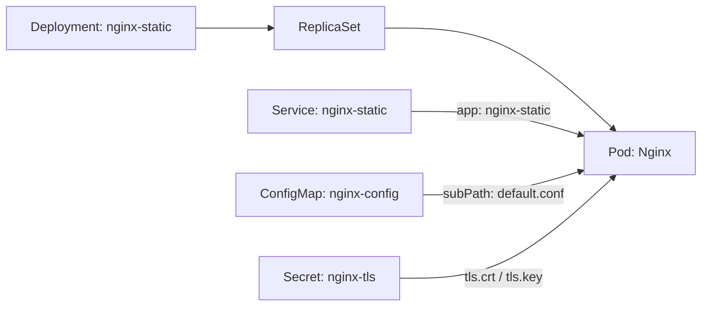

# CKA Task 001 Solution: ConfigMap의 TLS 설정 변경

## Preparation: 준비

저장소 루트에서 문제를 준비합니다.

```bash
./tasks/cka/001/scripts/setup.sh
cd tasks/cka/001
```

## Solution: 풀이

ConfigMap의 현재 설정을 확인하고 편집합니다.

```bash
kubectl --context kind-cloud-native-dojo -n nginx-static \
  get configmap nginx-config -o yaml

kubectl --context kind-cloud-native-dojo -n nginx-static \
  edit configmap nginx-config
```

`data.default.conf` 안의 프로토콜 설정을 다음과 같이 변경합니다.

```nginx
ssl_protocols TLSv1.2 TLSv1.3;
```

Deployment를 재시작하여 변경된 설정을 적용합니다.

```bash
kubectl --context kind-cloud-native-dojo -n nginx-static \
  rollout restart deployment/nginx-static

kubectl --context kind-cloud-native-dojo -n nginx-static \
  rollout status deployment/nginx-static --timeout=180s
```

## Explanation: 해설

### Resources: 문제 리소스 연결



[문제 manifest](fixtures/resources.yaml)에서 리소스 관계를 확인할 수 있습니다. ConfigMap의 `default.conf`는 컨테이너의 `/etc/nginx/conf.d/default.conf`에 파일 하나로 마운트됩니다. TLS Secret은 `/etc/nginx/tls`에 인증서와 개인 키를 제공합니다.

Service는 `app: nginx-static` label의 Pod를 선택합니다. Service의 `port: 443`은 Pod의 이름 있는 `https` 포트, 즉 443으로 연결됩니다. NodePort는 30007입니다.

### Configuration: 설정 변경이 반영되는 과정

Nginx의 `ssl_protocols`는 서버가 허용하는 TLS 버전을 지정합니다. ConfigMap만 수정한 직후에는 API와 기존 Pod 파일의 값이 다를 수 있습니다.

| 관찰 대상 | ConfigMap 변경 직후 | Pod 교체 후 |
| --- | --- | --- |
| API의 `ssl_protocols` | `TLSv1.2 TLSv1.3` | `TLSv1.2 TLSv1.3` |
| Pod의 설정 파일 | `TLSv1.3` | `TLSv1.2 TLSv1.3` |
| Nginx의 허용 프로토콜 | TLS 1.3 | TLS 1.2·1.3 |

기존 파일은 `subPath` 마운트여서 ConfigMap 변경을 전달받지 않습니다. 새 Pod는 최신 ConfigMap을 마운트하고, Nginx는 시작하면서 그 파일을 읽습니다. 따라서 ConfigMap 수정과 Pod 교체를 모두 완료해야 서버에 새 설정이 적용됩니다. 인증서와 개인 키는 기존 Secret을 계속 사용합니다.

Deployment·ConfigMap·Service·Secret의 이름을 유지하면서 Pod를 교체합니다. 기존 리소스의 UID가 유지되고 새 Pod의 UID가 바뀌는지 조회하여 확인할 수 있습니다.

```text
ConfigMap 수정 → Pod 교체 → Nginx가 새 설정 읽기 → TLS 1.2 접속 확인
```

### Verification: 실제 접속을 확인하는 이유

- readiness probe는 TCP 443 연결을 확인합니다. Ready여도 TLS 1.2가 허용된 것은 아닙니다.
- `rollout status`는 Deployment 업데이트 완료를 확인합니다. TLS 1.2 요청을 따로 보냅니다.
- `--tlsv1.2`와 `--tls-max 1.2`를 함께 사용하면 요청을 TLS 1.2로 한정할 수 있습니다.
- `-k`는 실습용 자체 서명 인증서의 검증을 생략합니다. 서버의 허용 TLS 버전을 바꾸지는 않습니다.
- 수동 port-forward는 선택된 Pod에 연결되므로 Pod 교체 후 종료하고 다시 시작합니다. 로컬 30007 포트로 보내는 요청은 직접 NodePort 경로를 통과하지 않습니다.
- `./scripts/verify.sh`는 ConfigMap의 TLS 1.2 설정, Deployment 준비 상태, NodePort 설정 유지, 실제 TLS 1.2 요청을 검사합니다.
- 기존 TLS 1.3 접속도 유지되는지는 `--tlsv1.3 --tls-max 1.3`으로 한정한 수동 요청으로 확인할 수 있습니다.

## Related Concepts: 관련 개념

| 개념 | 이 풀이에서 적용한 내용 | 독립 실습 |
| --- | --- | --- |
| [ConfigMap](../../../concepts/k8s/configmap/README.md) | 설정 데이터와 `subPath`의 갱신 동작 | [Workout](../../../concepts/k8s/configmap/workout.md) |
| [Deployment](../../../concepts/k8s/deployment/README.md) | 기존 Deployment를 유지하면서 Pod 교체 | [Workout](../../../concepts/k8s/deployment/workout.md) |
| [Service](../../../concepts/k8s/service/README.md) | selector, 포트 연결, 로컬 port-forward | [Workout](../../../concepts/k8s/service/workout.md) |
| [Secret](../../../concepts/k8s/secret/README.md) | 인증서와 개인 키 전달 | [Workout](../../../concepts/k8s/secret/workout.md) |
| [TLS](../../../concepts/networking/tls/README.md) | 허용 프로토콜과 버전을 한정한 요청 검증 | [Workout](../../../concepts/networking/tls/workout.md) |

workout은 각 개념의 전용 환경에서 진행합니다. 이 문제의 Namespace `nginx-static`을 사용하거나 수정하지 않습니다.

## Review: 되짚어보기

- API에 새 설정이 있어도 서버 동작이 그대로인 이유는 무엇일까요?
- Pod 교체 전후에 유지해야 하는 리소스와 바뀌는 리소스는 무엇일까요?
- TLS Secret을 그대로 두고 TLS 1.2를 허용할 수 있는 이유는 무엇일까요?
- 설정 파일 조회, rollout 완료, TLS 요청은 각각 무엇을 확인할까요?

## Verify and Cleanup: 검증·정리

```bash
./scripts/verify.sh
```

성공하면 `CKA Task 001 complete.`가 출력됩니다. 수동으로 실행한 port-forward는 `Ctrl+C`로 종료합니다.
다시 연습하려면 문제 Namespace와 작업 파일을 정리한 뒤 준비합니다.

```bash
./scripts/cleanup.sh
./scripts/setup.sh
```

## References: 참고 문서

- 제공된 `2-1 task-configmap (2).pdf`의 ConfigMap·TLS 문제를 로컬 kind 환경에 맞게 구성했습니다.
- [Kubernetes ConfigMaps](https://kubernetes.io/docs/concepts/configuration/configmap/)
- [Nginx ssl_protocols](https://nginx.org/en/docs/http/ngx_http_ssl_module.html#ssl_protocols)
- [curl TLS options](https://curl.se/docs/manpage.html#--tls-max)
